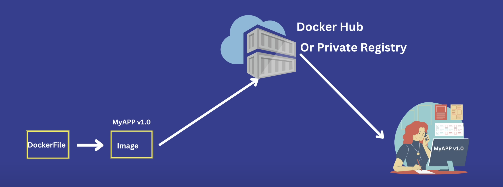

# Docker

**Step 1: Create Dockerfile**
- Creating Docker file with same name "**Dockerfile**"

**Step 2: Creating Docker Image**
```
docker build .
```
- **Result ✅**

```
writing image sha256:163c56b07d4b80c15ed9025c276c3114df01d2fffba887ae 
```
**Step 3: List of Docker Images**
- For checking image:

```
docker image ls
```
- **Result ✅**

| REPOSITORY | TAG | IMAGE ID | CREATED | SIZE |
|--------------|-------------|--------------|-------------|------------|
| none | none | 163c56b07d4b | 44 seconds ago | 1.16GB |
                 
**Step 4: Run and Manage docker container**
- Creating container:
```
docker run <imageId>
```

- **Result ☑️**
```
testapp@0.0.0 dev
> vite


  VITE v7.1.2  ready in 178 ms

  ➜  Local:   http://localhost:5173/
  ➜  Network: use --host to expose

This site can’t be reached
```

- **(Question)** Why these **This site can’t be reached** the message show when we going to **http://localhost:5173** that **Expose 5173** is assign in docker file?


- **(Answer)** This error occurs because Docker containers run in an isolated environment. In the Dockerfile, `EXPOSE 5173` only informs that the application inside the container will use port 5173, but it does not automatically make it accessible from the host machine.
When you run `docker run {imageId}`, the application is running inside the container on port 3000, but your host system cannot reach it directly. To access it from your browser at `http://localhost:5173`, 

---

### you need to publish the port using:

- **Port Binding For Accessing site in outside the container**

- **Left side (5173)** = port on your host machine (MacBook in your case).

- **Right side (5173)** = port inside the container where the app is running.

```
docker run -p <which PORT>:<Expose PORT> <imageId>
```
---

### 🖼️ Simple analogy:

- **localhost only:** “Main sirf apne ghar ke andar ki baatein sununga.”

- **0.0.0.0:** “Main sabhi darwaazon pe baatein sununga, chaahe padosi ya bahar se koi aaye.”


---
### Process state:
- **For Checking which process is running [The (docker ps) command only shows containers that are in the running state.]** 
```
docker ps
```
- **Result ✅**

| CONTAINER ID | IMAGE ID | COMMAND | CREATED | STATUS | PORTS | NAMES |
|--------------|-------------|--------------|-------------|------------|------------|------------|
| 5feefd9d375a | b82aff127418 | docker-entrypoint.s… | 19 seconds ago | Up 19 minutes | 0.0.0.0:5173->5173/tcp, [::]:5173->5173/tcp | adoring_cohen |

---
- **And How to stop**
```
docker stop <NAMES>
```
---

### 🏃 Running container in detached mode:
- Detached Mode is useful for running application in background without stuck terminal at same point.
- Detached Mode ka use application ko background me run karne ke liye hota hai, taaki terminal busy na ho.
- Is mode me container background me run karta hai aur aapka terminal free rehta hai.

```
docker run -d -p 5173:5173 <imageId>
```

- **Result ✅**
```
d81c1717adc694f40297e43bd9adfdd14467048926d09387f88955f2546b0d13
```


---

### 🏃 Running Mutiple Container/Application with single Image:
**My Container 1 Running PORT At 5173 And We Listen on Machine 5173**
- **When we listen again same PORT:**
```
docker run -d -p 5173:5173 b82aff127418
```
- **Result ❌**
```
docker: Error response from daemon: failed to set up container networking: driver failed programming external connectivity on endpoint admiring_raman (9bfbe510fc2f1fc47a8116fd8bf3c7d5b662a82e5e21a2e16bf7f4573710c37f): Bind for 0.0.0.0:5173 failed: port is already allocated

Run 'docker run --help' for more information

NOTE: These response in you PC alread PORT 5173 in used.
```

- **(Question) So how we create mutiple container with same image ?**
- **(Answer) We run the Container 2 PORT At 5173 And We Listen on Machine with (Differet PORT) 3000**

**Container 2**
```
docker run -d -p 3000:5173 b82aff127418
```
- **Result ✅**
```
912bf56e56e49ee77f34d7ea5a4810f36a74661d86903978521ef5744a03bec7
```

**Container 3**
```
docker run -d -p 4000:5173 b82aff127418
```
- **Result ✅**
```
1b000d819425de59be94a8e125b2e5f0fc50792ccb824ced09801a1b2b0d7c6d
```

---

### 🐳 Here we come to the advantages of DOCKER and the proof that every container has an isolated env:
- We can run multiple containers from a single image.
- Here we also say that **container 1**, **container 2**, **container 3** run on same port that **is not possible if container is not isolated Environment.**.
- For example, **Container 1**, **Container 2**, and **Container 3** **can run independently**. **They cannot use the same port on the same host, but because containers are isolated environments**, they can still run without conflict (by mapping to different host ports).
- Running multiple containers from the same image can also help in **load balancing** for websites.

---

### Process state status:
- **The (docker ps -a) command shows all containers, including those in running, exited, and created states.**
```
docker ps -a
```
- **Result ✅**

| CONTAINER ID | IMAGE ID | COMMAND | CREATED | STATUS | PORTS | NAMES |
|--------------|-------------|--------------|-------------|------------|------------|------------|
| ec9e210d867c | b82aff127418 | docker-entrypoint.s… | 12 hours ago | Created | 0.0.0.0:5173->5173/tcp, [::]:5173->5173/tcp | adoring_cohen |
| 912bf56e56e4 | b82aff127418 | docker-entrypoint.s… | 12 hours ago | Running | 0.0.0.0:5173->5173/tcp, [::]:5173->5173/tcp | adoring_cohen |
| 1b000d819425 | b82aff127418 | docker-entrypoint.s… | 12 hours ago | Running | 0.0.0.0:5173->5173/tcp, [::]:5173->5173/tcp | adoring_cohen |
| 5feefd9d375a | b82aff127418 | docker-entrypoint.s… | 13 hours ago | Exited | 0.0.0.0:5173->5173/tcp, [::]:5173->5173/tcp | adoring_cohen |

---

### 🗑️ Removing Docker containers that are in the **(Created)** or **(Exited)** state:
- **Removing a (single) Docker container in Created or Exited state:**
```
docker rm <Names>
```
- **Result ✅**
```
admiring_raman
```
- **Removing a (multiple) Docker container in Created or Exited state:**
```
docker rm <Names> <Names> <Names> <Names>....
```
- **Result ✅**
```
brave_haibt
boring_rubin
adoring_cohen
```

---

### 🗑️ Automatically removing a container when it is in the Exited state:
- **These containers only run until they are stopped. If I stop one, it is automatically removed.**
```
docker run -d --rm -p 4000:5173 <imageId>
```
- **Result ✅**
```
80b50976e8cd81dbce4d03984284c3b991cfd56d343bbe9941389ad9ea358557
```

---

### Naming the Container:
- By default, Docker gives containers a random name **(like adoring_cohen).**
```
docker run -d --rm --name "myWebApp" -p 4000:5173 <imageId>
```
- **Result ✅**
```
80b50976e8cd81dbce4d03984284c3b991cfd56d343bbe9941389ad9ea358557
```
- **With the help of the container name, we can remove the container.**
```
docker rm 'myWebApp'
```
- **Result ✅**
```
myWebApp
```
---

### 🏹 Managing Docker Images
- **Giving Name to the (image) repo and (taging) to the image:**
```
docker build -t myfirstimage:01 .
docker build -t <repo_name>:<tag> .
```

- **Note(1):** . dot means jis directory me Dockerfile present hai.
- **Note(2):** repository name must be lowercase.
- **Result ✅**
```
writing image sha256:b82aff12741884d5716d5a9fa275a9f7a089d3f304d5ec208bf76907b02207f3
naming to docker.io/library/myfirstimage:01
```

- **All Images:**
```
docker image ls
```

- **Result ✅**

| REPOSITORY | TAG | IMAGE ID | CREATED | SIZE |
|--------------|-------------|--------------|-------------|------------|
| myfirstimage | 01 | b82aff127418 | 14 hours ago | 1.16GB |


- **If we create version 2 of that image [b82aff127418]:**
- **Note:** jub tak koi change hum project me nh karegenge tab tak v2 of imageID same rahegi.
```
docker build -t myfirstimage:02 .
```

- **Result ✅**
```
writing image sha256:b82aff12741884d5716d5a9fa275a9f7a089d3f304d5ec208bf76907b02207f3
naming to docker.io/library/myfirstimage:02
```

```
docker image ls
```

- **Result ✅**

| REPOSITORY | TAG | IMAGE ID | CREATED | SIZE |
|--------------|-------------|--------------|-------------|------------|
| myfirstimage | 01 | b82aff127418 | 14 hours ago | 1.16GB |
| myfirstimage | 02 | b82aff127418 | 14 hours ago | 1.16GB |

**🗑️ For Deleting the image:**
```
docker rmi <repo_name>:<tag>
```

- **Result ✅**
```
Untagged: myfirstimage:02
```

---

### 🆙 What if we update the Project:
- **If we make any changes in the project files,**
- **we do not need to change anything in the Dockerfile.**
- **When we create version 2 of the project, it generates a new Image ID.**

```
docker build -t 'myfirstimage:02' .
```
- **Note:** It return New ImageID.

- **Result ✅**
```
writing image sha256:d693416b93c8427ba8cafb40072b00733f075e15bbe9e413c1a0ad7c2b30c6ef 
naming to docker.io/library/myfirstimage:02
```

| REPOSITORY | TAG | IMAGE ID | CREATED | SIZE |
|--------------|-------------|--------------|-------------|------------|
| myfirstimage | 02 | d693416b93c8 (diff ID) | 46 seconds ago | 1.16GB |
| myfirstimage | 01 | b82aff127418 | 14 hours ago | 1.16GB |


**We also Created the container with REPOSITORY name instead of IMAGEID:**
```
docker run -d --rm --name "myWebApp02" -p 3000:5173 myfirstimage:02
docker run -d --rm --name "myWebApp02" -p 3000:5173 <repo_name>:<tag>
```

- **Result ✅**
```
ef88c5f436afaeb870dc4a9c6d032912e8a8fc37e34fa6b16950a2508b59fc56
```

---

### 📒 Pre-Defined Docker images:
- **Fetch Predefined images that are present on DOCKER HUB:**
```
docker pull python
docker pull nginx
```

---

### 💻 Docker container with Interactive Mode:
- **For interactive mode, we create a Python program to calculate the sum of two numbers.**

```
docker build -t "python_intractive_mode" .
```
- **Result ✅**
```
writing image sha256:be96c04e51f2cf134cbce21534846a5d9a3b57c040ad6ac5fd73b70289d75032
docker.io/library/python_intractive_mode
```

| REPOSITORY | TAG | IMAGE ID | CREATED | SIZE |
|--------------|-------------|--------------|-------------|------------|
| python_intractive_mode | latest | be96c04e51f2 | 2 minutes ago | 1.12GB |


- **(Question) What happen when create container for python program ?**
- **Command:** (docker run  python_intractive_mode:latest)
- **(Answer) It throws an error because the Python program is waiting for input. To fix this, we need to run the container in interactive mode.** 

```
docker run  python_intractive_mode:latest
```
- **Result ❌**
```
Enter the 1st number: Traceback (most recent call last):
  File "/myapp/sum.py", line 1, in <module>
    a = int(input("Enter the 1st number: "));
            ~~~~~^^^^^^^^^^^^^^^^^^^^^^^^^^
EOFError: EOF when reading a line
```

- **We use the (-it) option to run the container in interactive mode, which allows us to provide input to the Python program.**
```
docker run -it be96c04e51f2
docker run  python_intractive_mode:latest
```

- **Result ✅**
```
Enter the 1st number: 4
Enter the 1st number: 5
Sum of 4 + 5 =  9
```

---

### 👥 Sharing Images to the DOCKER HUB:


- #### **[Developer]** ----> **[IMAGE]** ----> **[Tester]**
- #### **We push the image to the Docker registry on Docker Hub.**
- #### **[Developer]** ----> **[Dockerfile]** ----> **[IMAGE]** ----> **[DockerHub]** ----> **[Tester]**


---

### **Step 1: Build the Docker image**

Create the image with the same name and tag as your Docker Hub repository:

```bash
docker build -t vishalyadav0987/demo-vite-app:01 .
```

---

### **Step 2: Push the image to Docker Hub**

After building, push the image to your Docker Hub repository:

```bash
docker push vishalyadav0987/demo-vite-app:01
```

---

👉 This way, the image `vishalyadav0987/demo-vite-app:01` will be available on Docker Hub under your account.


- **Result ✅**

```bash
docker pull vishalyadav0987/demo-vite-app:01
```

---

### 🚋 Rename the Docker image:

```bash
docker tag myfirstimage:02 vishalyadav0987/demo-vite-app:02
docker tag <old_name>:<tag> <new_name>:<tag>
```

- **Result ✅**
```
REPOSITORY                      TAG       IMAGE ID       CREATED             SIZE
vishalyadav0987/demo-vite-app   01        c867216650b0   12 minutes ago      1.16GB
python_intractive_mode          latest    be96c04e51f2   55 minutes ago      1.12GB
myfirstimage                    02        d693416b93c8   About an hour ago   1.16GB
vishalyadav0987/demo-vite-app   02        d693416b93c8   About an hour ago   1.16GB
```
- **Note:** Previous image bhi rheti jisko hamne new name se change means old and new are thier.

- ### When we redeploy the jisko humne change [myfirstimage:02 vishalyadav0987/demo-vite-app:02]
```bash
docker push vishalyadav0987/demo-vite-app:02
```


- **Result ✅**
```
34799c5eb741: Pushed 
3aba3f582bb5: Pushed 
5315b464fef5: Layer already exists 
bd393a05bfb5: Layer already exists 
7fd2629d59f2: Layer already exists 
0413d3169966: Layer already exists 
a1482e066328: Layer already exists 
936d81443473: Layer already exists 
61a723bcedf7: Layer already exists 
f680c9b2c572: Layer already exists 
563cc2194f6b: Layer already exists 
02: digest: sha256:c04173478dc8f752ec7b1904f4b921f1021e9b13dfd0ffc1c27780998e7abf49 size: 2631
```

- **Note:** When we deploy the same image with a different tag but the same Image ID (no changes in the project), Docker links it to the image that was previously pushed and preseved the space.

---
